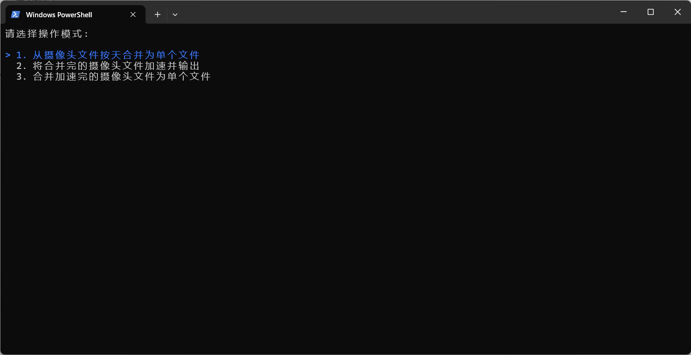
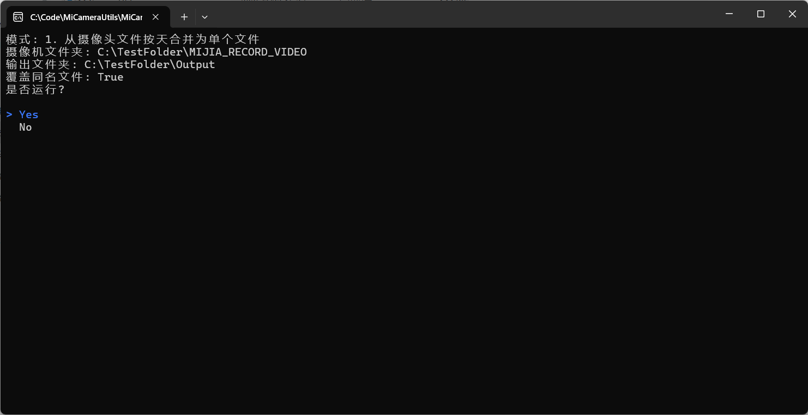
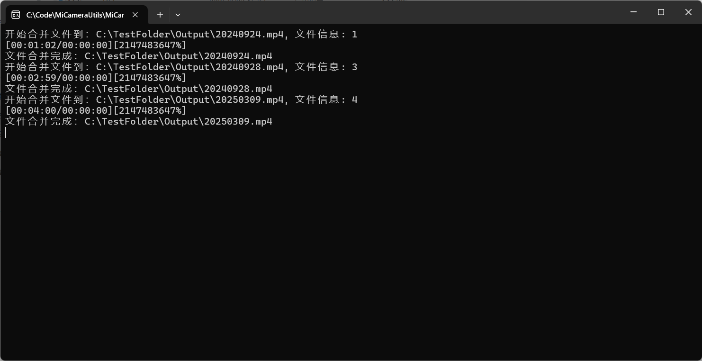
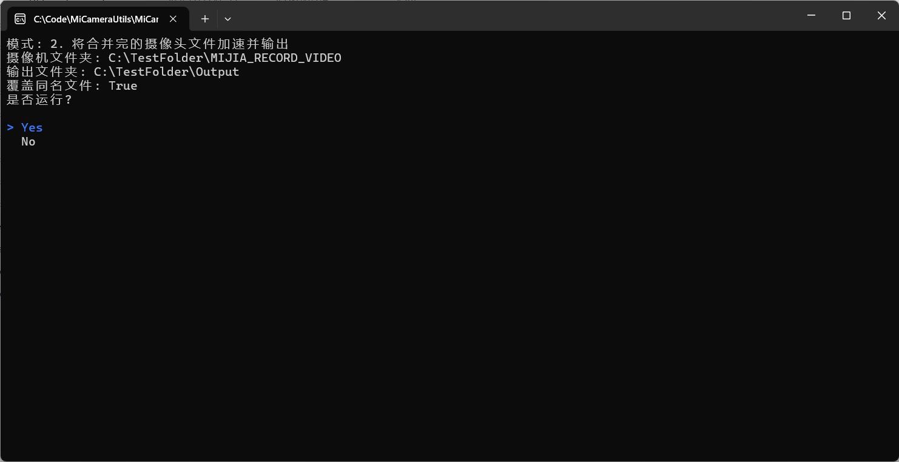
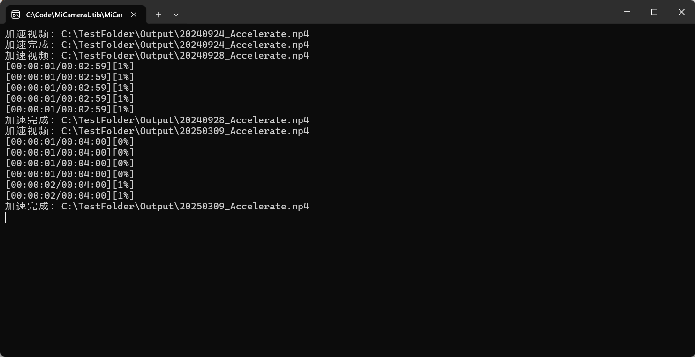
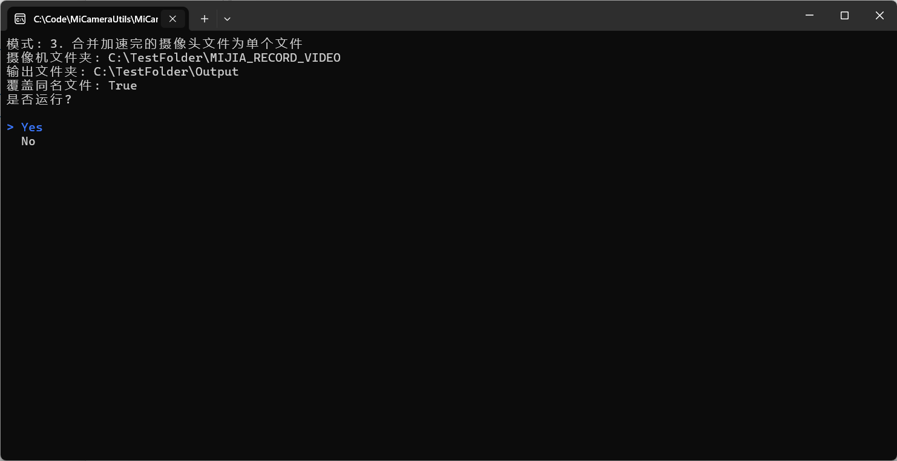
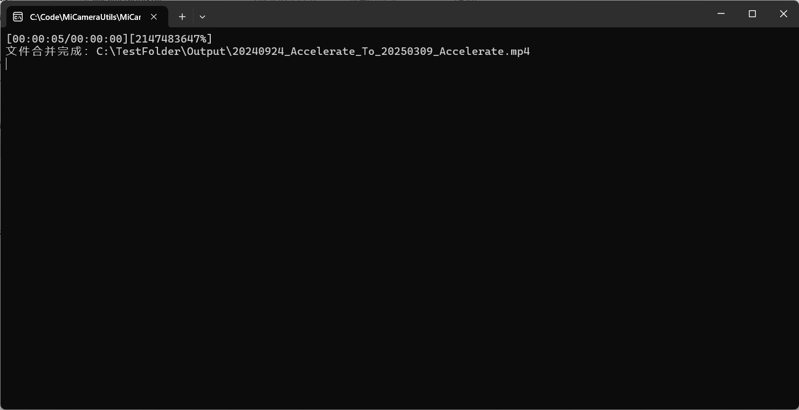

# Mi Camera Utils

[[_TOC_]]

小米摄像头工具, 用于合并视频, 制作倍速视频

## 功能介绍

合并视频, 制作倍速视频

### 摄像头视频合并

可以将小米摄像头的录制视频按照天合并成一个完整的视频, 格式 `YYYYMMdd.mp4`

### 摄像头视频倍速

支持将按天合并好的摄像头视频按照一定比例输出倍速视频, 默认倍速100倍, 格式 `YYYYMMdd__Accelerate.mp4`

### 加速好的视频合并

将加速完的视频合并成一个完整的视频, 格式 `YYYYMMdd_Accelerate_To_YYYYMMdd_Accelerate.mp4`

## 测试机器

小米智能摄像机2 云台版

## 使用方式

打开 `appsettings.MiCameraUtils.json`

1. 配置好相机文件的根目录 `CameraDirectory` 和输出目录 `OutputDirectory`
2. 如果机器不支持cuda硬件加速, 请修改 `VideoAcceleratorSettings` => `Parameters` => `-hwaccel cuda`, `-c:v hevc_cuvid` 和 `-c:v hevc_nvenc` 为其它类型或者删除硬件加速选项
3. `OverwriteOutput` 用于配置如果输出目录有重名的文件是否覆盖现有文件, `true` 覆盖, `false` 不覆盖
4. 双击 `MiCameraUtils.exe` 文件开始合并, 或者命令行运行 `.\MiCameraUtils.exe` 或者 `dotnet MiCameraUtils.dll`
